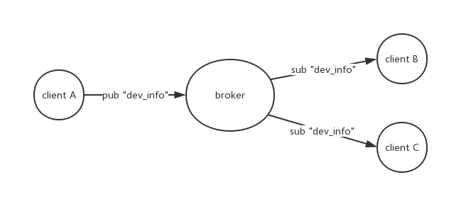

# MQTT 概述
  
MQTT(Message Queuing Telemetry Transport，消息队列遥测传输协议)是最初由IBM开发的一种基于发布/订阅模式的轻量级通信协议,工作在tcp/ip协议簇上。主要优势是
低开销、低带宽，在lot上应用较为广泛。

# MQTT 架构
1. MQTT 是c/s模型，每个客户端通过tcp连接到服务器(broker)；
2. MQTT 是面向消息的。每个消息都是独立的数据块，对于broker来说是不透明的；
3. 每条消息都会发送到一个地址，这个地址称为主题(topic),订阅主题的每个客户端都会收到发布到该主题上的每条消息；

# 参考  

 1. [维基百科 MQTT](https://zh.wikipedia.org/wiki/MQTT)  
 2. [MQTT manpage](https://mosquitto.org/man/mqtt-7.html)